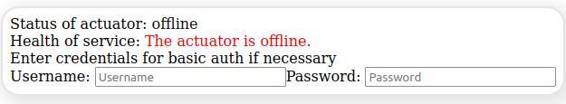
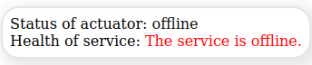

:toc:
:toclevels: 5
:toc-placement!:

# Service Health Status Check

_You want to monitor your Spring Boot (or other ones implementing the `/health` endpoint) applications in a React web application? Then, you are at the right place._

*A straightforward plugin for checking the status of a Spring Boot web service.*

NPM: link:https://www.npmjs.com/package/@qanary/spring-boot-health-check[https://www.npmjs.com/package/@qanary/spring-boot-health-check]

toc::[]

## Installation

This is a package that is intended to be used with React, so React needs to be installed.

Type declarations are provided in the package and no other dependencies are needed.

Using `npm`: `npm i @qanary/spring-boot-health-check`

Using `yarn`: `yarn add @qanary/spring-boot-health-check`

## Usage Examples

### Basic Example

Health Check for `type="admin"`



Health Check for `type="basic"`




Use the following React component parameters to monitoring a Webservice being deployed to http://localhost:8000:

```jsx
<SpringBootHealthCheck
  // The host of the spring boot application
  springBootAppUrl="http://localhost:8000"
  // The interval in milliseconds for checking the health status
  checkInterval={10000}
  // The HTML class property of the component
  className={"health-check"}
  // Enable to use the default styling, disable and add custom classes for custom styling
  shouldUseDefaultStyling
  // The kind of health check that will be performed
  // Default is "actuator" for regular spring boot actuator health endpoints
  // "admin" is for HTTP Basic password-protected Stardog endpoints
  // "basic" is for a dumb request to the provided URL verifying the response is ok
  type={"basic"}
  />
```

Example for overwriting the colours:

```css
:root {
  --ok-color: rgb(122, 123, 0) !important;
  --problem-color: blue !important;
  --offline-color: rgb(11, 11, 11) !important;
}
```

### Working Examples

Working examples can be found in the examples directory:

* link:./examples/basic-web-page/README.adoc[Using the plug-in on a basic web page]
* link:./examples/typical-react-application/README.adoc[Using the plug-in in a typical React application]
