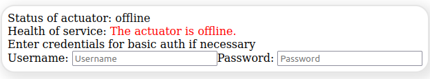
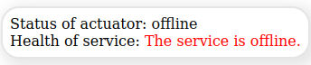

# Service Health Status Check

_You want to monitor your Spring Boot (or other ones implementing the `/health` endpoint) applications in a React web application? Then, you are at the right place._

**A straightforward plugin for checking the status of a Spring Boot web service.**

NPM: [https://www.npmjs.com/package/@qanary/spring-boot-health-check](https://www.npmjs.com/package/@qanary/spring-boot-health-check)

- [Service Health Status Check](#service-health-status-check)
  - [Installation](#installation)
  - [Usage Examples](#usage-examples)
    - [Basic Example](#basic-example)
    - [Working Examples](#working-examples)

## Installation

This is a package that is intended to be used with React, so React needs to be installed.

Type declarations are provided in the package and no other dependencies are needed.

Using `npm`: `npm i @qanary/spring-boot-health-check`

Using `yarn`: `yarn add @qanary/spring-boot-health-check`

## Usage Examples

### Basic Example

Health Check for `type="admin"`



Health Check for `type="basic"`



```jsx
<SpringBootHealthCheck
  // a human-readable service name
  // Default is "service"
  name="My Spring Boot App"
  // The host of the spring boot application
  springBootAppUrl="http://localhost:8000"
  // The interval in milliseconds for checking the health status
  checkInterval={10000}
  // The HTML class property of the component
  className={"health-check"}
  // The type of styling preset to use
  // Default is "default" for all information with simple styling
  // "simple" for condensed information with simple styling
  // "minimal" for a coloured circle showing the status
  // "none" for no styling which is ideal for custom styles
  stylePreset="minimal"
  // The kind of health check that will be performed
  // Default is "actuator" for regular spring boot actuator health endpoints
  // "admin" is for HTTP Basic password-protected Stardog endpoints
  // "basic" is for a dumb request to the provided URL verifying the response is ok
  type={"basic"}
/>
```

Example for overwriting the colours:

```css
:root {
  --ok-color: rgb(122, 123, 0) !important;
  --problem-color: blue !important;
  --offline-color: rgb(11, 11, 11) !important;
}
```

### Working Examples

Working examples can be found in the examples directory:

- [Using the plug-in on a basic web page](./examples/basic-web-page/README.md)
- [Using the plug-in in a typical React application](./examples/typical-react-application/README.md)
